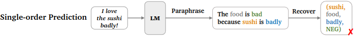
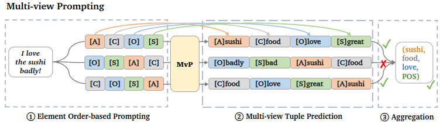

1. Nhược điểm của các nghiên cứu trước

các nghiên cứu hiện tại thường dự đoán các thành phần sentiment (aspect, sentiment, opinion, category) theo một trật tự cố định, bỏ qua ảnh hưởng của sự phụ thuộc lẫn nhau của các thành phần trong một tuple và sự đa dạng của cách diện đạt ngôn ngữ đối với kết quả

- Dự đoán các tuple không phải là nhiệm vụ tạo văn bản một cách tự nhiên, mối quan hệ giữa các phần tử không được xếp theo thứ tự mà phụ thuộc lẫn nhau

- Không ổn định, theo nghiên cứu của Hu at al. (Improving aspect sentiment quad prediction via template-order data augmentation 2022), hiệu suất của target template order khác nhau là khác nhau đáng kể

- Tích lũy lối, các lỗi dự đoán trước đó sẽ được tích lũy và ảnh hưởng đến các dự đoán sau này

2. Phương pháp của MvP

nghiên cứu này tổng hợp các thành phần sentiment được tạo ra theo các thứ tự khác nhau, tận dụng trực giác của các quá trình giải quyết vấn đề (giống con người từ các góc nhìn khác nhau)

MvP sử dụng element order-based prompt learning để kiểm soát thứ tự dự đoán của các thành phần sentiment, cho phép biểu diễn mục tiêu một cách đa dạng.

MVP đưa ra lời nhắc về thứ tự phần tử để hướng dẫn mô hình ngôn ngữ tạo ra nhiều sentiment tuples, mỗi tuples có thứ tự phần tử khác nhau, sau đó chọn các bộ dữ liệu hợp lý nhất bằng cách bỏ phiếu

MVP có thể lập mô hình multi-view, multi-task (dưới dạng hoán vị và kết hợp các phần tử)

3. Thực nghiệm và kết quả

Outperforming so với các phương pháp đơn nhiệm vụ trước đó trên nhiều tác vụ ABSA bằng một mô hình duy nhất

Thử nghiệm được thực hiện trên 10 bộ dữ liệu, 4 benchmark tasks

- Aspect Category Opinion Sentiment (ACOS), output (a,c,o,s), tập trung vào các aspects và opinions ngầm so với ASQP

- Aspect Sentiment Quad Prediction  (ASQP), output (a,c,o,s)

- Aspect Sentiment Triplet Extraction (ASTE), output (a,o,s)

- Target Aspect Sentiment Detection (TASD), output (a,c,s)

Low-resource settings

cross-task transfer settings (huấn luyện trên một task cụ thể, đánh giá mô hình trên môt task khác)

