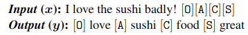
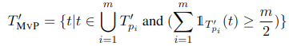
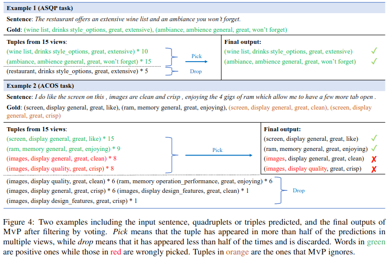
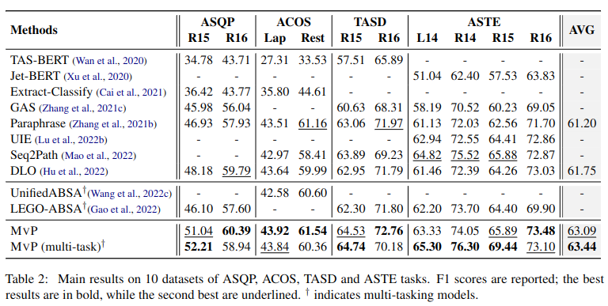
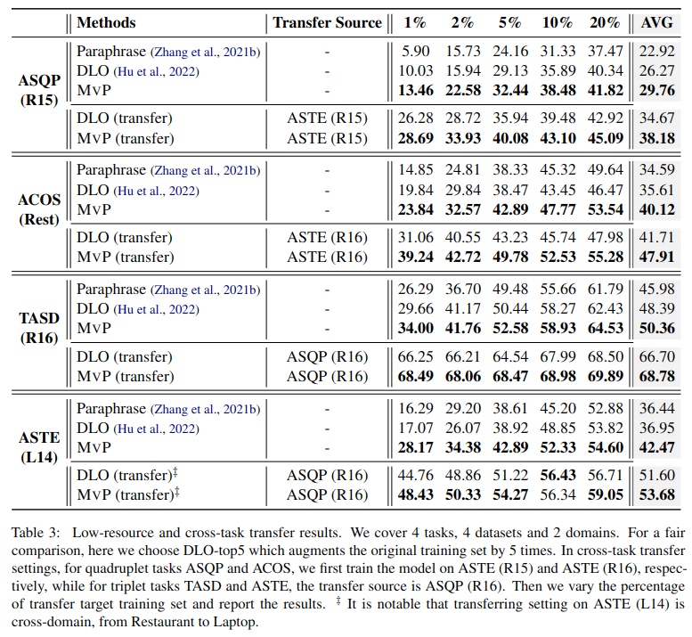
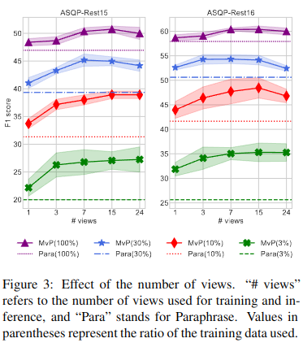
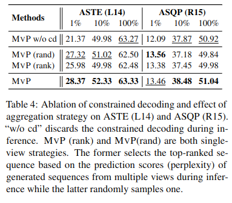
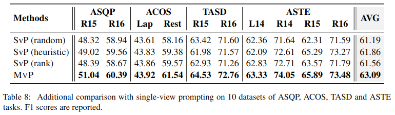

1. Nhược điểm của các nghiên cứu trước

các nghiên cứu hiện tại thường dự đoán các thành phần sentiment (aspect, sentiment, opinion, category) theo một trật tự cố định, bỏ qua ảnh hưởng của sự phụ thuộc lẫn nhau của các thành phần trong một tuple và sự đa dạng của cách diện đạt ngôn ngữ đối với kết quả

- Dự đoán các tuple không phải là nhiệm vụ tạo văn bản một cách tự nhiên, mối quan hệ giữa các phần tử không được xếp theo thứ tự mà phụ thuộc lẫn nhau

- Không ổn định, theo nghiên cứu của Hu at al. (Improving aspect sentiment quad prediction via template-order data augmentation 2022), hiệu suất của target template order khác nhau là khác nhau đáng kể

- Tích lũy lối, các lỗi dự đoán trước đó sẽ được tích lũy và ảnh hưởng đến các dự đoán sau này

2. Phương pháp của MvP

nghiên cứu này tổng hợp các thành phần sentiment được tạo ra theo các thứ tự khác nhau, tận dụng trực giác của các quá trình giải quyết vấn đề (giống con người từ các góc nhìn khác nhau)

MvP sử dụng element order-based prompt learning để kiểm soát thứ tự dự đoán của các thành phần sentiment, cho phép biểu diễn mục tiêu một cách đa dạng.

MVP đưa ra lời nhắc về thứ tự phần tử để hướng dẫn mô hình ngôn ngữ tạo ra nhiều sentiment tuples, mỗi tuples có thứ tự phần tử khác nhau, sau đó chọn các bộ dữ liệu hợp lý nhất bằng cách bỏ phiếu

MVP có thể lập mô hình multi-view, multi-task (dưới dạng hoán vị và kết hợp các phần tử)

some views give the same corect tuples, while some views might be wrong, but it's unlikely to result in the same error. Different views tend to show more agreement in the correct sentiment tuples

để tận dụng ngữ nghĩa của nhãn, theo (Zhang et al.), tác giả diễn giải các phần tử  (a,c,o,s) sang ngôn ngữ tự nhiên riêng biệt (ea, ec, eo, es). Ví dụ đối với sentiment polarity (s) "POS" --> "great"; với opinion term (o) "NULL" --> "it"

đầu ra - target được xử lý thành dạng "[O]eo[A]ea[C]ec[S]es", thứ tự theo đầu vào

nếu đầu ra có nhiều tuples thì nối dùng bằng token đặc biệt [SSEP]

2.3.1 Element Order Selection ????

Vì chi phí chung tăng tuyến tính với số views và hiệu suất của các views khác nhau nên tác giả chọn những element orders phù hợp

chọn một subset trong mọi hoán ví của các thành phần sentiment (6 for the triplet and 24 for the quadruplet) để nhanh và hiệu quả

chọn các thứ tự có khả năng hoạt động tốt hơn dựa trên entropy trung bình của các hoán vị ứng viên trên tập huấn luyện

- sử dụng mọi hoán vị pi của sentiment elements làm ứng viên

- với một câu đầu vào x và các bộ mục tiêu của nó, thay thế các element markers bằng spaces để tránh nhiễu, sử dụng một pre-trained language model để lấy confitional generation scores

- tính trung bình cộng điểm của hoán vị pi trên bộ training set

- rank các hoán ví pi và sử dụng top m hoán vị sử dụng trong quá trình huấn luyện

2.4. Multi-view Inference

- sử dụng constrained generation

tổng hợp các views dựa theo công thức sau

3. Thực nghiệm

3.1 Tasks and Dataset

Outperforming so với các phương pháp đơn nhiệm vụ trước đó trên nhiều tác vụ ABSA bằng một mô hình duy nhất

2 domain: Laptop, Restaurant

4 benchmark tasks

- Aspect Category Opinion Sentiment (ACOS), output (a,c,o,s), tập trung vào các aspects và opinions ngầm so với ASQP 

- Aspect Sentiment Quad Prediction  (ASQP), output (a,c,o,s)

- Aspect Sentiment Triplet Extraction (ASTE), output (a,o,s)

- Target Aspect Sentiment Detection (TASD), output (a,c,s)

Thử nghiệm được thực hiện trên 10 bộ dữ liệu

- ASQP-R15, ASQP-R16 (được phát triển tiếp bởi Zhang et al. 2021a)

- ACOS-Lap, ACOS-Rest (được phát triển bởi Cai et al. 2021)

- TASD-R15, TASD-R16

- ASTE-L14, ASTE-R14, ASTE-R15, ASTE-R16

- dataset của ASTE và TASD được lấy từ Xu et al. 2020, Wan et al 2020

3.2 Implement Details

- sử dụng T5-Base

- sử dụng greedy search

- đặt m chủ yếu bằng 5. Chỉ single-task model trong thí nghiệm chính sử dụng 15 views cho quadruplet tasks và 5 views cho triplet tasks

- số lượng views ở inference bằng số lượng view ở trong quá trình huấn luyện

- với multi-task settings, thêm các tiền tố như "ASQP:Rest15: " vào input

- với multi-task settings, loại bỏ các instance trong train dataset trùng lặp với instance trong test set trong bắt cứ task nào

- với multi-task settings, validation set = 10%. Được lấy ngẫu nhiên mỗi lần chạy

3.3 Evaluation Metrics

- F1 được lấy trung bình cộng 5 lần huấn luyện

- for all ABSA task, a predicted sentiment tuple is considered as correct if and only if all its elements are exactly the same as the gold tuple.

3.4 Compared Methods

Discriminative methods

- TAS-BERT (Wan et al. 2020)

- Extract-Classify (Cai et al. 2021)

- Jet-BERT (Xu et al. 2020)

Generative methods

- GAS (Zhang et al. 2021c)

- Paraphrase (Zhang et al. 2021a)

- Seq2Path (Mao et al. 2022)

- DLO/ILO (Hu et al. 2022)

- UIE (Lu et al. 2022)

Multi-tasking methods

- LEGO-ABSA (Gao et al. 2022)

- UnifiedABSA (Wang et al.  2022)

Large language model (gpt-3.5-turbo): so sánh với zero và few-shot prompts sử dụng gpt-3.5-turbo

4. Results and Discussions

Single-task and Multi-task

Low-resource Results, cross-task transfer settings (huấn luyện trên một task cụ thể, đánh giá mô hình trên môt task khác)

Effect of the number of views

- với ít dữ liệu, tăng số lượng view có thể làm tăng F1

- với dữ liệu nhiều hơn, tăng số lượng view làm giảm F1

single views

- Elements ranked ahead of the top selected orders are mostly free-form term "[A]" and "[O]", which have higher uncertainty than "[C]" and "[S]". Therefore, we propose using the "[A][O][C][S]" order heuristically

Effect of aggregation strategy

Effect of constrained decoding

